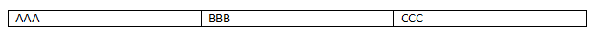

# 表格行
使用`<w:tr>`元素来定义表格的行
```
<w:tr>
  <w:tc>
    <w:tcPr>
      <w:tcW w:w="2880" w:type="dxa"/>
    </w:tcPr>
    <w:p>
      <w:r>
        <w:t>AAA</w:t>
      </w:r>
    </w:p>
  </w:tc>
  <w:tc>
    <w:tcPr>
      <w:tcW w:w="2880" w:type="dxa"/>
    </w:tcPr>
    <w:p>
      <w:r>
        <w:t>BBB</w:t>
      </w:r>
    </w:p>
  </w:tc>
  <w:tc>
    <w:tcPr>
      <w:tcW w:w="2880" w:type="dxa"/>
    </w:tcPr>
    <w:p>
      <w:r>
        <w:t>CCC</w:t>
      </w:r>
    </w:p>
  </w:tc>
</w:tr>
```
_**参考：** ECMA-376，第3版（2011年6月），基础和标记语言参考§17.4.79。_



## 内容

`<w:tr>`元素可以包含元件多种元素，大多与跟踪修改和添加自定义XML相关。主要元素如下所示
|元素|描述|
|---|---|
|trPr|指定行的行级属性。这些属性会影响行中单元格的外观，但可以被单个单元格级别的属性覆盖。请参见[表行属性](http://officeopenxml.com/WPtableRowProperties.php)。<br>_**参考：** ECMA-376，第3版（2011年6月），基础和标记语言参考§17.4.82。_|
|tblPrEx|指定行的表属性以代替**tblPr**中指定的表属性。这些属性通常用于遗留文档，以及合并两个独立表的情况（以防止第二个表的属性被第一个表的属性取代）。请[参见表属性异常](http://officeopenxml.com/WPtablePropertyExceptions.php)。<br>_**参考：** ECMA-376，第3版（2011年6月），基础和标记语言参考§17.4.61。_|
|tc|指定表格单元格。见表格单元格。<br>_**参考：** ECMA-376，第3版（2011年6月），基础和标记语言参考§17.4.66。_|

## 属性
`tr`元素可以拥有一个ID元素，包括了`rsidDel`, `rsidR`, `rsidRPr`, and `rsidTr`。它们用于跟踪编辑，这里省略。

# 相关的HTML / CSS属性：
```
<tr>
  <td>AAA</td>
  <td>BBB</td>
  <td>CCC</td>
</tr>
```
